# 🌱 Complete Analysis: Plant Disease Detection MLOps Pipeline

> **Comprehensive repository analysis covering architecture, implementation, workflows, and core concepts**

---

## 📖 Table of Contents

1. [Executive Summary](#executive-summary)
2. [Project Overview (Narrative)](#project-overview-narrative)
3. [Architecture & System Design](#architecture--system-design)
4. [Core Components Deep Dive](#core-components-deep-dive)
5. [Workflows & Operations](#workflows--operations)
6. [Examples & Use Cases](#examples--use-cases)
7. [Testing Strategies](#testing-strategies)
8. [Deployment Guide](#deployment-guide)
9. [Monitoring & Observability](#monitoring--observability)
10. [Best Practices & Patterns](#best-practices--patterns)

---

## Executive Summary

This is a **production-ready MLOps pipeline** for automated plant disease detection from images. The project demonstrates industry best practices for:

- ✅ End-to-end ML lifecycle management (data → training → deployment → monitoring)
- ✅ Multiple model architectures (CNN and Vision Transformers)
- ✅ Experiment tracking with MLflow
- ✅ Containerized deployment with Docker & Kubernetes
- ✅ Automated CI/CD with GitHub Actions
- ✅ Production monitoring with Prometheus & Grafana
- ✅ RESTful API for real-time inference

**Key Metrics:**
- **Dataset**: PlantVillage (15 classes in current config, up to 38 supported)
- **Expected Accuracy**: 90-95% for CNN models
- **Inference Latency**: <50ms per image
- **API Latency**: <100ms
- **Scalability**: Hundreds of requests/second with autoscaling

---

## Project Overview (Narrative)

### The Problem

Agricultural productivity is threatened by plant diseases that can devastate entire crops. Traditional disease identification requires:
- Expert agronomists (expensive, scarce)
- Manual inspection (slow, error-prone)
- Visual expertise (takes years to develop)

### The Solution

This project provides an **AI-powered automated diagnosis system** that:

1. **Accepts** plant leaf images
2. **Analyzes** using deep learning models
3. **Classifies** the disease (or healthy state)
4. **Returns** predictions with confidence scores in milliseconds

### The Journey of Data

```
📸 Image Capture → 🔄 Preprocessing → 🧠 Model Inference → ✅ Disease Prediction
```

**Step-by-step narrative:**

1. **Image Collection**: Farmers/researchers capture leaf images
2. **Upload**: Images sent to REST API endpoint
3. **Preprocessing**: Images are:
   - Resized to 224x224 pixels
   - Normalized using ImageNet statistics
   - Converted to tensors
4. **Inference**: Deep learning model processes the image
5. **Classification**: Model outputs probabilities for each disease
6. **Response**: API returns the predicted disease + confidence score
7. **Monitoring**: Metrics logged to Prometheus for observability

---

## Architecture & System Design

### High-Level Architecture


### Component Architecture


### Technology Stack

| Layer | Technologies |
|-------|-------------|
| **AI/ML** | PyTorch, PyTorch Lightning, Transformers, torchvision |
| **Data** | Albumentations, NumPy, Pandas, PIL, OpenCV |
| **API** | FastAPI, Uvicorn, Pydantic |
| **MLOps** | MLflow, DVC |
| **Containerization** | Docker, Docker Compose |
| **Orchestration** | Kubernetes, Helm |
| **CI/CD** | GitHub Actions |
| **Monitoring** | Prometheus, Grafana, Evidently |
| **Testing** | pytest, pytest-cov |

---

## Core Components Deep Dive

### 1. Data Preprocessing (`src/data_preprocessing.py`)

#### Purpose
Transforms raw images into ML-ready tensors with augmentation for robust training.

#### Key Classes

**`PlantDiseaseDataset`** (PyTorch Dataset)
```python
class PlantDiseaseDataset(Dataset):
    def __init__(self, image_paths, labels, transform=None)
    def __len__(self)
    def __getitem__(self, idx)  # Returns (image_tensor, label)
```

**`DataPreprocessor`**
```python
class DataPreprocessor:
    - setup_directories()
    - get_data_augmentation(is_training)
    - load_dataset_info(dataset_path)
    - split_dataset(image_paths, labels)
    - create_data_loaders(dataset_path)
```

#### Data Augmentation Strategy

**Training Transforms:**
```python
- Resize(224x224)
- Rotate(±30°, p=0.5)           # Handle different orientations
- HorizontalFlip(p=0.5)          # Mirror symmetry
- VerticalFlip(p=0.3)            # Rare but possible
- RandomBrightnessContrast       # Lighting variations
- GaussianBlur                   # Simulate camera blur
- GaussNoise                     # Sensor noise
- Normalize (ImageNet stats)     # Transfer learning compatibility
- ToTensorV2()                   # Convert to PyTorch tensor
```

**Validation/Test Transforms:**
```python
- Resize(224x224)
- Normalize (ImageNet stats)
- ToTensorV2()
```

#### Data Split Configuration

From `config.yaml`:
- **Train**: 70% (for learning patterns)
- **Validation**: 20% (for hyperparameter tuning)
- **Test**: 10% (for final evaluation)

**Stratified splitting** ensures balanced class distribution across splits.

---

### 2. Model Architectures (`src/models.py`)

#### A. CNN Models (`PlantDiseaseCNN`)

Supports **three architectures**:

**ResNet50:**
```
Input (3x224x224) → Conv Layers → Residual Blocks → Avg Pool → FC Layer → Output (num_classes)
```
- **Pre-trained**: ImageNet weights
- **Parameters**: ~23M
- **Best for**: General-purpose, proven performance

**EfficientNet-B0:**
```
Input → MBConv Blocks (efficient) → SE Attention → FC Layer → Output
```
- **Pre-trained**: ImageNet weights
- **Parameters**: ~4M (most efficient)
- **Best for**: Resource-constrained environments

**VGG16:**
```
Input → 13 Conv Layers → 3 FC Layers → Output
```
- **Pre-trained**: ImageNet weights
- **Parameters**: ~138M (largest)
- **Best for**: When accuracy > efficiency

**Implementation Pattern:**
```python
class PlantDiseaseCNN(pl.LightningModule):
    def __init__(self):
        self.backbone = self._create_backbone()  # ResNet/Efficient/VGG
        self.classifier = nn.Linear(backbone_size, num_classes)
    
    def forward(self, x):
        features = self.backbone(x)
        return self.classifier(features)
    
    def training_step(self, batch, batch_idx):
        # Compute loss, log metrics
    
    def configure_optimizers(self):
        # Adam/SGD + CosineAnnealing/StepLR
```

#### B. Vision Transformer (`PlantDiseaseViT`)

```
Input Image (3x224x224) 
  ↓
Patch Embedding (16x16 patches)
  ↓
Position Encoding
  ↓
Transformer Encoder (12 layers)
  ↓
Classification Head
  ↓
Output Logits (num_classes)
```

**Architecture Details:**
- **Model**: ViT-Base (google/vit-base-patch16-224)
- **Patch Size**: 16x16 (results in 196 patches)
- **Hidden Size**: 768
- **Attention Heads**: 12
- **Parameters**: ~86M

**Key Advantages:**
- Global context from self-attention
- State-of-the-art accuracy
- Transfer learning from vision tasks

---

### 3. Training Pipeline (`src/train.py`)

#### MLflow Integration


**Logged Parameters:**
```python
# Data params
batch_size, image_size, train_split, val_split, test_split

# Model params
model_type, architecture, num_classes, pretrained, freeze_backbone

# Training params
epochs, learning_rate, weight_decay, optimizer, scheduler
```

**Logged Metrics (per epoch):**
```python
# Training
- train_loss
- train_acc

# Validation
- val_loss
- val_acc

# Test (final)
- test_loss
- test_acc
- final_* metrics
```

#### Training Configuration

From `config.yaml`:
```yaml
training:
  epochs: 5                    # Quick testing (increase for production)
  learning_rate: 0.001         # Adam default
  weight_decay: 1e-4           # L2 regularization
  optimizer: "adam"            # Adam or SGD
  scheduler: "cosine"          # CosineAnnealing or StepLR
  early_stopping_patience: 10  # Stop if no improvement
  save_best_only: true         # Keep best model only
```

#### Callbacks

1. **ModelCheckpoint**: Save best model based on `val_acc`
2. **EarlyStopping**: Stop if `val_loss` doesn't improve for 10 epochs
3. **LearningRateMonitor**: Log LR changes
4. **Progress Bar**: Visual feedback

---

### 4. Inference API (`src/api.py`)

#### FastAPI Application

**Architecture:**
```
PlantDiseaseInferenceAPI (core logic)
  ↓
FastAPI app (REST endpoints)
  ↓
Uvicorn (ASGI server)
```

#### API Endpoints

| Method | Endpoint | Purpose | Input | Output |
|--------|----------|---------|-------|--------|
| GET | `/` | Info | - | API details |
| GET | `/health` | Health check | - | `{"status": "healthy"}` |
| POST | `/predict` | Single prediction | Image file | `{prediction, confidence, probabilities}` |
| POST | `/predict_batch` | Batch prediction | Multiple files | List of predictions |
| GET | `/classes` | List classes | - | `{num_classes, classes}` |
| GET | `/metrics` | Prometheus metrics | - | Metrics in Prometheus format |

#### `/predict` Example Flow

```python
# 1. Receive image
file = await file.read()  # FastAPI UploadFile

# 2. Preprocess
image_tensor = preprocess_image(file)
# - Open with PIL
# - Apply transforms (resize, normalize)
# - Convert to tensor

# 3. Inference
with torch.no_grad():
    logits = model(image_tensor)
    probs = F.softmax(logits, dim=1)
    
# 4. Get prediction
confidence, pred_class = probs.max(dim=1)
disease_name = class_mapping[pred_class]

# 5. Return response
return {
    "prediction": disease_name,
    "confidence": float(confidence),
    "probabilities": {class: prob for class, prob in zip(classes, probs)}
}
```

#### Prometheus Metrics

```python
# Request metrics
prediction_requests = Counter('predictions_total', 'Total predictions')
prediction_errors = Counter('prediction_errors_total', 'Errors')

# Latency
prediction_duration = Histogram('prediction_duration_seconds', 
                                'Prediction latency')

# Confidence distribution
confidence_gauge = Gauge('prediction_confidence', 
                        'Last prediction confidence')

# Resource metrics
model_loaded = Gauge('model_loaded', 'Model load status')
```

---

### 5. Containerization (`docker/`)

#### Dockerfile Strategy

```dockerfile
# Multi-stage concept (currently single-stage)
FROM nvidia/cuda:11.8-runtime-ubuntu20.04

# System dependencies
RUN apt-get update && apt-get install -y \
    python3.9 python3.9-dev python3-pip git curl

# Python dependencies
COPY requirements.txt .
RUN pip install --no-cache-dir -r requirements.txt

# Application code
COPY src/ ./src/
COPY config.yaml .

# Runtime
EXPOSE 8000 9090
CMD ["python", "src/api.py"]
```

**Key Features:**
- CUDA support for GPU acceleration
- Health check endpoint
- Non-root user (security best practice)
- Optimized layer caching

#### Docker Compose Services

```yaml
services:
  plant-disease-api:     # Main API (port 8000)
  mlflow-server:          # Experiment tracking (port 5000)
  prometheus:             # Metrics collection (port 9090)
  grafana:                # Visualization (port 3000)
  redis:                  # Caching (port 6379, optional)
```

**Local Development:**
```bash
docker-compose -f docker/docker-compose.yml up -d

# Access:
# API: http://localhost:8000
# MLflow: http://localhost:5000
# Grafana: http://localhost:3000 (admin/admin)
# Prometheus: http://localhost:9090
```

---

### 6. Kubernetes Deployment (`k8s/`)

#### Resource Manifests

**namespace.yaml**: Isolate mlops resources
```yaml
apiVersion: v1
kind: Namespace
metadata:
  name: mlops
```

**deployment.yaml**: Application deployment
```yaml
apiVersion: apps/v1
kind: Deployment
spec:
  replicas: 3               # High availability
  template:
    spec:
      containers:
      - name: api
        image: anwar/plant-disease-mlops:latest
        resources:
          requests:
            memory: "2Gi"
            cpu: "1000m"
          limits:
            memory: "4Gi"
            cpu: "2000m"
            nvidia.com/gpu: 1
        livenessProbe:        # Auto-restart if unhealthy
        readinessProbe:       # Don't route until ready
```

**service.yaml**: Load balancer
```yaml
apiVersion: v1
kind: Service
spec:
  type: LoadBalancer
  ports:
  - port: 80
    targetPort: 8000
```

**storage.yaml**: Persistent volumes
```yaml
# Model storage PVC
kind: PersistentVolumeClaim
spec:
  accessModes: [ReadOnlyMany]
  resources:
    requests:
      storage: 5Gi

# Data storage PVC
kind: PersistentVolumeClaim
spec:
  accessModes: [ReadOnlyMany]
  resources:
    requests:
      storage: 10Gi
```

**hpa.yaml**: Horizontal Pod Autoscaler
```yaml
apiVersion: autoscaling/v2
kind: HorizontalPodAutoscaler
spec:
  minReplicas: 3
  maxReplicas: 10
  metrics:
  - type: Resource
    resource:
      name: cpu
      target:
        type: Utilization
        averageUtilization: 70
```

---

## Workflows & Operations

### Workflow 1: Training a New Model

```mermaid
sequenceDiagram
    participant Dev as Developer
    participant CLI as train_pipeline.py
    participant Data as DataPreprocessor
    participant Model as PlantDiseaseCNN/ViT
    participant MLflow as MLflow Server
    
    Dev->>CLI: python scripts/train_pipeline.py --dataset data/raw/PlantVillage --model cnn
    CLI->>Data: create_data_loaders()
    Data->>Data: Load images, split, augment
    Data-->>CLI: DataLoaders
    CLI->>MLflow: Setup experiment
    CLI->>Model: create_model('cnn')
    Model->>Model: Initialize ResNet50
    CLI->>Model: trainer.fit()
    loop Each Epoch
        Model->>Model: training_step()
        Model->>MLflow: Log metrics
        Model->>Model: validation_step()
    end
    Model->>MLflow: Save best model
    Model-->>CLI: Training complete
    CLI-->>Dev: ✅ Success
```



**Commands:**
```bash
# Train CNN model
python scripts/train_pipeline.py \
  --dataset data/raw/PlantVillage \
  --model cnn \
  --config config.yaml

# Train Vision Transformer
python scripts/train_pipeline.py \
  --dataset data/raw/PlantVillage \
  --model vit

# Train with specific GPU
python scripts/train_pipeline.py \
  --dataset data/raw/PlantVillage \
  --model cnn \
  --gpu 0
```

---

### Workflow 2: Deploying to Production


**Steps:**

1. **Local Testing**
```bash
# Run tests
pytest src/ -v --cov=src

# Lint code
flake8 src/
black src/ --check
isort src/ --check
```

2. **Build & Push Image**
```bash
# Build
docker build -f docker/Dockerfile -t anwar/plant-disease-mlops:latest .

# Push
docker push anwar/plant-disease-mlops:latest
```

3. **Deploy to Kubernetes**
```bash
# Apply all manifests
kubectl apply -f k8s/

# Check rollout status
kubectl rollout status deployment/plant-disease-api -n mlops

# Verify pods
kubectl get pods -n mlops

# Check logs
kubectl logs -f deployment/plant-disease-api -n mlops
```

---

### Workflow 3: Making Predictions


**Example Client Code:**

```python
import requests

# Single prediction
with open('plant_leaf.jpg', 'rb') as f:
    response = requests.post(
        'http://localhost:8000/predict',
        files={'file': f}
    )

result = response.json()
print(f"Disease: {result['prediction']}")
print(f"Confidence: {result['confidence']:.2%}")
```

**Batch Prediction:**
```python
files = [
    ('files', open('leaf1.jpg', 'rb')),
    ('files', open('leaf2.jpg', 'rb')),
    ('files', open('leaf3.jpg', 'rb')),
]

response = requests.post(
    'http://localhost:8000/predict_batch',
    files=files
)

for i, pred in enumerate(response.json()['predictions']):
    print(f"Image {i+1}: {pred['prediction']} ({pred['confidence']:.2%})")
```

---

## Examples & Use Cases

### Example 1: End-to-End Training

```python
# Step 1: Prepare data
from src.data_preprocessing import DataPreprocessor

preprocessor = DataPreprocessor('config.yaml')
data_result = preprocessor.create_data_loaders('data/raw/PlantVillage')

print(f"Classes: {data_result['num_classes']}")
print(f"Train samples: {len(data_result['data_loaders']['train'].dataset)}")

# Step 2: Create model
from src.models import create_model

model = create_model('cnn', 'config.yaml')
print(f"Model: {model.__class__.__name__}")

# Step 3: Train
from src.train import train_model

trained_model, trainer = train_model(
    model_type='cnn',
    dataset_path='data/raw/PlantVillage',
    config_path='config.yaml'
)

# Step 4: Evaluate
test_results = trainer.test(
    trained_model,
    data_result['data_loaders']['test']
)

print(f"Test Accuracy: {test_results[0]['test_acc']:.2%}")
```

---

### Example 2: Custom Inference

```python
from src.api import PlantDiseaseInferenceAPI
from PIL import Image

# Initialize API
api = PlantDiseaseInferenceAPI('config.yaml')

# Load image
image = Image.open('tomato_leaf.jpg')

# Preprocess
import io
img_bytes = io.BytesIO()
image.save(img_bytes, format='JPEG')
img_bytes = img_bytes.getvalue()

tensor = api.preprocess_image(img_bytes)

# Predict
result = api.predict(tensor)

print(f"Prediction: {result['prediction']}")
print(f"Confidence: {result['confidence']:.4f}")
print("\nTop 3 predictions:")
for disease, prob in sorted(
    result['probabilities'].items(),
    key=lambda x: x[1],
    reverse=True
)[:3]:
    print(f"  {disease}: {prob:.2%}")
```

---

### Example 3: CI/CD Integration

**.github/workflows/ci.yml** breakdown:

```yaml
# Job 1: Test
jobs:
  test:
    runs-on: ubuntu-latest
    steps:
      - Checkout code
      - Setup Python 3.9
      - Cache dependencies
      - Install dependencies
      - Run linting (flake8, black, isort)
      - Run tests with coverage
      - Upload coverage to codecov

  # Job 2: Build & Push (only on main branch)
  build-and-push:
    needs: test
    if: github.ref == 'refs/heads/main'
    steps:
      - Checkout code
      - Setup Docker Buildx
      - Login to Docker Hub
      - Build and push image
      - Tag: latest, sha-xxx, branch name

  # Job 3: Deploy to staging (only on develop branch)
  deploy-staging:
    needs: build-and-push
    if: github.ref == 'refs/heads/develop'
    environment: staging
    steps:
      - Deploy to K8s staging
```

---

## Testing Strategies

### Unit Tests

**Test Data Preprocessing:**
```python
# tests/test_data_preprocessing.py
def test_data_augmentation():
    preprocessor = DataPreprocessor()
    
    # Training transforms
    train_transform = preprocessor.get_data_augmentation(is_training=True)
    assert 'Rotate' in str(train_transform)
    assert 'HorizontalFlip' in str(train_transform)
    
    # Test transforms (no augmentation)
    test_transform = preprocessor.get_data_augmentation(is_training=False)
    assert 'Rotate' not in str(test_transform)

def test_dataset_split():
    preprocessor = DataPreprocessor()
    image_paths = [f'img_{i}.jpg' for i in range(100)]
    labels = [i % 5 for i in range(100)]  # 5 classes
    
    splits = preprocessor.split_dataset(image_paths, labels)
    
    assert 'train' in splits
    assert 'val' in splits
    assert 'test' in splits
    
    # Check proportions
    train_size = len(splits['train'][0])
    assert 65 <= train_size <= 75  # ~70%
```

**Test Models:**
```python
# tests/test_models.py
def test_cnn_forward_pass():
    model = create_model('cnn')
    batch = torch.randn(4, 3, 224, 224)  # Batch of 4 images
    
    output = model(batch)
    
    assert output.shape == (4, model.config['model']['num_classes'])

def test_vit_forward_pass():
    model = create_model('vit')
    batch = torch.randn(2, 3, 224, 224)
    
    output = model(batch)
    
    assert output.shape == (2, model.config['model']['num_classes'])
```

**Test API:**
```python
# tests/test_api.py
from fastapi.testclient import TestClient
from src.api import app

client = TestClient(app)

def test_health_endpoint():
    response = client.get('/health')
    assert response.status_code == 200
    assert response.json()['status'] == 'healthy'

def test_predict_endpoint():
    # Create dummy image
    from PIL import Image
    import io
    
    img = Image.new('RGB', (224, 224), color='green')
    buf = io.BytesIO()
    img.save(buf, format='JPEG')
    buf.seek(0)
    
    response = client.post(
        '/predict',
        files={'file': ('test.jpg', buf, 'image/jpeg')}
    )
    
    assert response.status_code == 200
    result = response.json()
    assert 'prediction' in result
    assert 'confidence' in result
    assert 0 <= result['confidence'] <= 1
```

---

### Integration Tests

```python
# tests/integration/test_pipeline.py
def test_full_pipeline():
    # 1. Prepare data
    preprocessor = DataPreprocessor()
    data = preprocessor.create_data_loaders('data/raw/test_dataset')
    
    # 2. Train model (1 epoch)
    model = create_model('cnn')
    trainer = pl.Trainer(max_epochs=1, fast_dev_run=True)
    trainer.fit(model, data['data_loaders']['train'])
    
    # 3. Save model
    torch.save(model.state_dict(), 'models/test_model.ckpt')
    
    # 4. Load in API
    api = PlantDiseaseInferenceAPI()
    api.model.load_state_dict(torch.load('models/test_model.ckpt'))
    
    # 5. Test prediction
    test_image = next(iter(data['data_loaders']['test']))[0][0]
    result = api.predict(test_image.unsqueeze(0))
    
    assert 'prediction' in result
    assert 'confidence' in result
```

---

## Deployment Guide

### Local Development

**Quick Start:**
```bash
# 1. Clone repository
git clone https://github.com/Anwar011/Pipeline-MLOps-pour-la-d-tection-de-maladies-de-plantes.git
cd Pipeline-MLOps-pour-la-d-tection-de-maladies-de-plantes

# 2. Install dependencies
pip install -r requirements.txt

# 3. Download dataset
# Download PlantVillage from Kaggle
# Place in: data/raw/PlantVillage/

# 4. Train model
python scripts/train_pipeline.py \
  --dataset data/raw/PlantVillage \
  --model cnn

# 5. Run API
python scripts/run_api.py --host 0.0.0.0 --port 8000

# 6. Test
curl http://localhost:8000/health
```

---

### Docker Deployment

```bash
# Build image
docker build -f docker/Dockerfile -t plant-disease-api:latest .

# Run container
docker run -d \
  -p 8000:8000 \
  -v $(pwd)/models:/app/models:ro \
  -v $(pwd)/data:/app/data:ro \
  --name plant-disease-api \
  plant-disease-api:latest

# Check logs
docker logs -f plant-disease-api

# Test API
curl -X POST http://localhost:8000/predict \
  -F "file=@test_image.jpg"
```

**Using Docker Compose:**
```bash
# Start all services
docker-compose -f docker/docker-compose.yml up -d

# View logs
docker-compose -f docker/docker-compose.yml logs -f

# Stop all services
docker-compose -f docker/docker-compose.yml down
```

---

### Kubernetes Deployment

**Prerequisites:**
- Kubernetes cluster (minikube, GKE, EKS, AKS)
- kubectl configured
- Docker image pushed to registry

**Deployment Steps:**

```bash
# 1. Create namespace
kubectl apply -f k8s/namespace.yaml

# 2. Create persistent volumes
kubectl apply -f k8s/storage.yaml

# 3. Deploy application
kubectl apply -f k8s/deployment.yaml

# 4. Create service
kubectl apply -f k8s/service.yaml

# 5. Setup autoscaling
kubectl apply -f k8s/hpa.yaml

# 6. Verify deployment
kubectl get all -n mlops

# 7. Check pod logs
kubectl logs -f -l app=plant-disease-api -n mlops

# 8. Get service URL
kubectl get svc plant-disease-service -n mlops
```

**Accessing the API:**

```bash
# Port forward (local testing)
kubectl port-forward svc/plant-disease-service 8000:80 -n mlops

# Or get LoadBalancer IP
EXTERNAL_IP=$(kubectl get svc plant-disease-service -n mlops -o jsonpath='{.status.loadBalancer.ingress[0].ip}')
curl http://$EXTERNAL_IP/health
```

---

## Monitoring & Observability

### Prometheus Metrics

**API Metrics:**
```
# Request counters
predictions_total                   # Total prediction requests
prediction_errors_total             # Failed requests

# Latency histograms
prediction_duration_seconds_bucket  # Prediction time buckets
prediction_duration_seconds_sum
prediction_duration_seconds_count

# Gauge metrics
prediction_confidence               # Last prediction confidence
model_loaded                        # Model status (1=loaded, 0=not)
```

**Kubernetes Metrics:**
```
# Pod metrics
container_cpu_usage_seconds_total
container_memory_usage_bytes
container_network_receive_bytes_total
container_network_transmit_bytes_total

# Deployment metrics
kube_deployment_status_replicas
kube_deployment_status_replicas_available
```

---

### Grafana Dashboards

**Dashboard 1: API Performance**
- Request rate (req/s)
- Error rate (%)
- P50, P95, P99 latency
- Success rate

**Dashboard 2: ML Model Metrics**
- Prediction confidence distribution
- Class distribution (which diseases most common)
- Model drift indicators

**Dashboard 3: Infrastructure**
- CPU utilization per pod
- Memory usage
- Network I/O
- Pod restart count

**Dashboard 4: Business Metrics**
- Total predictions (daily/weekly)
- Most detected diseases
- Average confidence scores
- API uptime

---

## Best Practices & Patterns

### 1. Configuration Management

✅ **Centralized config** (`config.yaml`)
- All hyperparameters in one place
- Easy to version control
- Environment-specific overrides

```python
# Load config
with open('config.yaml', 'r') as f:
    config = yaml.safe_load(f)

# Use throughout codebase
batch_size = config['data']['batch_size']
```

---

### 2. Experiment Tracking

✅ **MLflow for reproducibility**
- Every training run logged
- Parameters, metrics, artifacts saved
- Easy model comparison

```python
with mlflow.start_run():
    mlflow.log_param('model_type', 'cnn')
    mlflow.log_metric('val_acc', val_acc)
    mlflow.pytorch.log_model(model, 'model')
```

---

### 3. Model Versioning

✅ **Semantic versioning for models**
- Tagging in MLflow
- Docker image tags match model versions
- Clear production vs staging models

---

### 4. Data Validation

✅ **Input validation in API**
```python
# File type check
if not file.content_type.startswith('image/'):
    raise HTTPException(400, "Must be an image")

# Image quality check
image = Image.open(io.BytesIO(contents))
if image.size[0] < 50 or image.size[1] < 50:
    raise HTTPException(400, "Image too small")
```

---

### 5. Error Handling

✅ **Graceful degradation**
```python
try:
    prediction = model(image)
except Exception as e:
    logger.error(f"Prediction failed: {str(e)}")
    return {"error": "Prediction failed", "details": str(e)}
```

---

### 6. Security

✅ **Best practices implemented**
- Non-root containers
- Read-only file systems where possible
- Secrets management (Kubernetes secrets)
- CORS configured properly
- Rate limiting (TODO: add)

---

### 7. Scalability Patterns

✅ **Horizontal scaling**
- Stateless API design
- Kubernetes HPA for auto-scaling
- Load balancing

✅ **Caching** (optional with Redis)
```python
# Cache predictions for identical images
cache_key = hashlib.md5(image_bytes).hexdigest()
if redis_client.exists(cache_key):
    return redis_client.get(cache_key)
```

---

## Key Concepts Explained

### MLOps Lifecycle

```
1. DATA COLLECTION
   ↓
2. DATA PREPARATION (augmentation, splitting)
   ↓
3. MODEL TRAINING (hyperparameter tuning)
   ↓
4. MODEL EVALUATION (metrics, validation)
   ↓
5. MODEL DEPLOYMENT (containerization, orchestration)
   ↓
6. MONITORING (drift detection, performance)
   ↓
7. FEEDBACK LOOP (retrain with new data)
```

---

### Transfer Learning

**Why it works:**
- Pre-trained models learned general visual features (edges, textures, shapes)
- Fine-tuning adapts these to plant diseases
- Faster training, better accuracy with less data

**Types:**
1. **Feature Extraction**: Freeze backbone, train only classifier
2. **Fine-tuning**: Train entire network with lower LR
3. **Progressive unfreezing**: Gradually unfreeze layers

---

### Data Augmentation Philosophy

**Goal**: Model should be invariant to transformations that don't change the class

**Valid augmentations for plants:**
- Rotation, flips (orientation doesn't matter)
- Brightness/contrast (lighting conditions vary)
- Blur, noise (simulate camera quality)

**Invalid augmentations:**
- Extreme color changes (disease signs are color-based)
- Heavy distortions (crop structure matters)

---

### Model Selection Criteria

| Model | Accuracy | Speed | Size | Use Case |
|-------|----------|-------|------|----------|
| ResNet50 | ⭐⭐⭐⭐ | ⭐⭐⭐ | ⭐⭐⭐ | **General purpose** |
| EfficientNet | ⭐⭐⭐⭐ | ⭐⭐⭐⭐ | ⭐⭐⭐⭐⭐ | **Edge devices** |
| VGG16 | ⭐⭐⭐ | ⭐⭐ | ⭐ | Legacy compatibility |
| ViT | ⭐⭐⭐⭐⭐ | ⭐⭐ | ⭐⭐ | **Max accuracy** |

---

## Troubleshooting Guide

### Common Issues

**1. Model not loading:**
```bash
# Check model file exists
ls -lh models/production/model.ckpt

# Verify config points to correct path
grep model_path config.yaml

# Check class mapping
cat data/class_mapping.json
```

**2. Low accuracy:**
- Check data quality (corrupted images?)
- Verify augmentation not too aggressive
- Increase epochs
- Try different architecture
- Check for class imbalance

**3. API timeout:**
- Reduce batch size
- Use GPU if available
- Enable model caching
- Check network latency

**4. Kubernetes pod crash:**
```bash
# Check pod events
kubectl describe pod <pod-name> -n mlops

# View logs
kubectl logs <pod-name> -n mlops --previous

# Common causes:
# - OOMKilled: Increase memory limits
# - ImagePullBackOff: Check image exists in registry
# - CrashLoopBackOff: Check health endpoint
```

---

## Conclusion

This MLOps pipeline represents **production-grade AI deployment** with:

✅ **Modularity**: Clear separation of concerns  
✅ **Reproducibility**: Everything tracked in MLflow  
✅ **Scalability**: Kubernetes autoscaling  
✅ **Observability**: Comprehensive monitoring  
✅ **Reliability**: Health checks, auto-recovery  
✅ **Maintainability**: Clean code, documentation  

**Next Steps:**
1. Add A/B testing for model comparison
2. Implement data drift detection
3. Add model explainability (GradCAM)
4. Expand to more plant species
5. Deploy to edge devices (Raspberry Pi)

---

**🎉 This pipeline is production-ready for plant disease detection at scale!**
